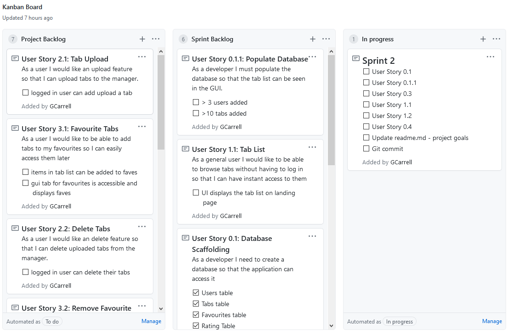
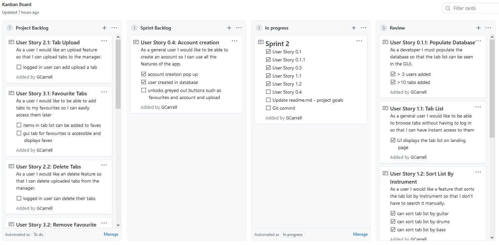
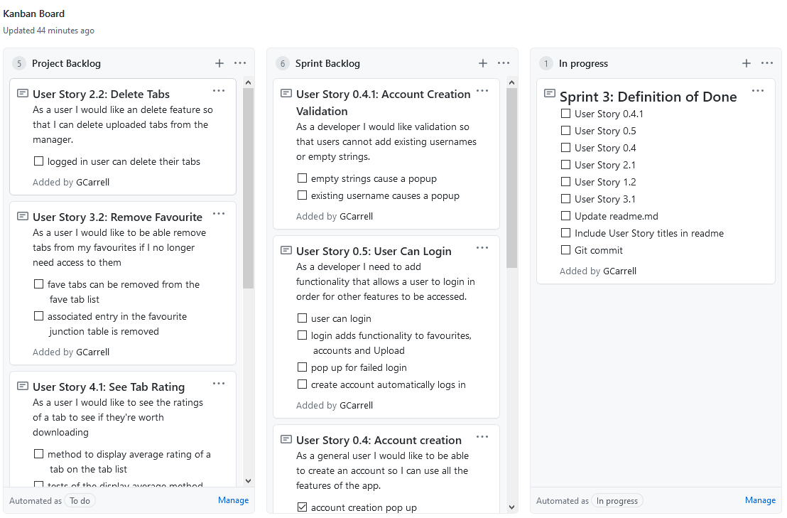
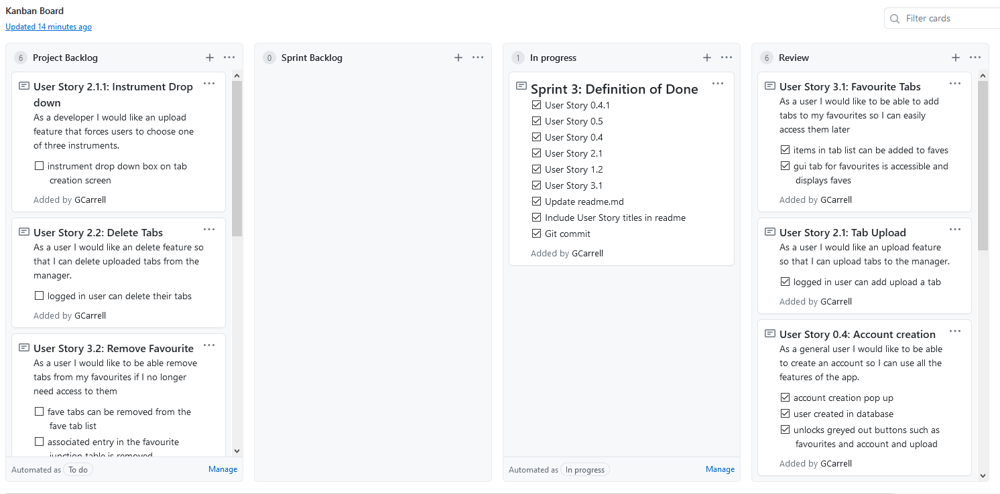
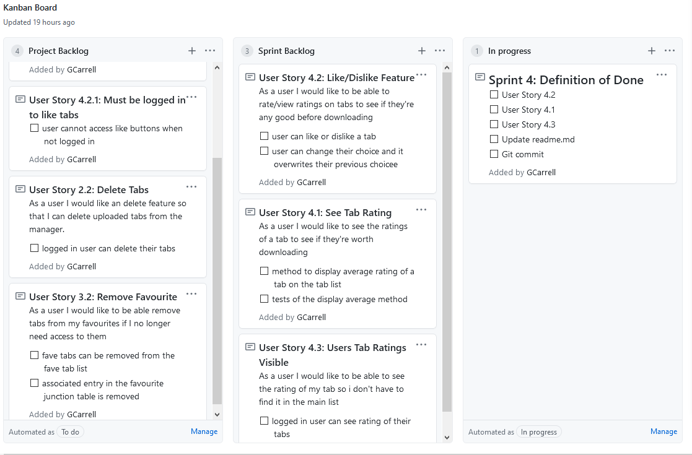
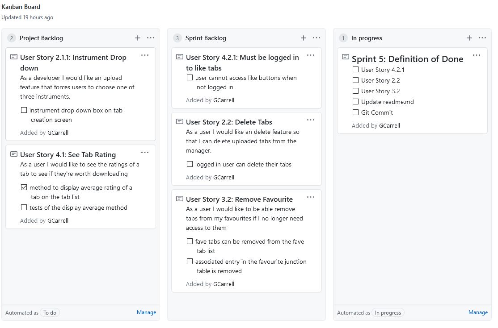
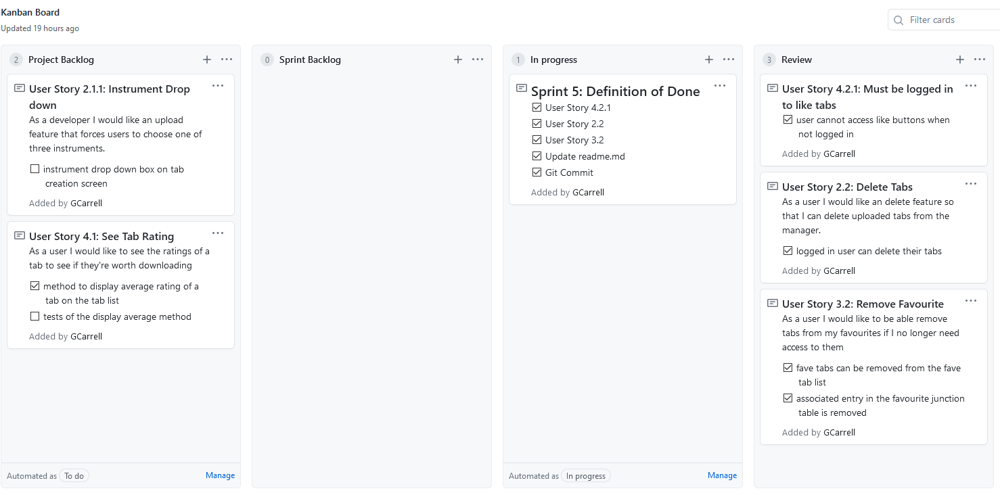

# MusicManager
## Project Overview 
The aim of this project is to create a 3 tier application that will allow the user to easily access and search through music tablature. Users with accounts will be able to upload tabs, rate tabs and add tabs to their favourites.

## Project Goals
The final product will have:
A WPF front end
An SQL database backend with at least two linked tables.
The relationship between the backend object model and database managed by entity framework.
A Business Layer with some logic - not just a simple CRUD application
Unit tests, which exercise the normal functionality, boundary and error conditions.

## Sprint Breakdowns
### Sprint 1
#### Sprint Review
By the end of Sprint 1 I had aimed to have my database completed and populated with faux data, some nUnit tests created and their methods extracted and a very simplistic GUI. I underestimated the length of time it would take to structure the database so by the end of the sprint I hadn't manage to populate the database, however the database had been created, some CRUD functions had been extracted from the nUnit tests and the GUI would possibly list the tab list if the tab list was populated.

#### Sprint Retrospective
Heading forward, I will base the Sprint backlog on the time I estimate it to take instead of what tasks I want to complete.
#### Goals
- [ ] User Story 0.1
- [x] User Story 0.2
- [ ] User Story 0.3
- [x] Update readme.md - project goals
- [x] Git init commit

#### Sprint Start

##### Sprint End

### Sprint 2
#### Sprint Review
At the end of Sprint 2 I had successfully populated my database with faux data. The ability for a user to create an account was added, with their data being inserted into the database by the back end. Conditions were added to prevent users with identical usernames from being added. Additional nUnit tests were created to test the identical username prevention conditions. The feature that unlocks the dead-buttons favourites, account and upload wasn't added as I realised it is heavily dependent on another feature I have yet to add, the ability to login! 

#### Sprint Retrospective
This Sprint went a lot smoother than Sprint 1, however it came apparent that some of my user stories were extremely interlinked and dependent on eachother, so from now on I should be more cautious in regards to task dependencies when planning the Spring Backlog. In terms of time management I believe I estimated the length of my tasks well and so will not have much runover into the next day.
#### Goals
- [x] User Story 0.1
- [x] User Story 0.1.1
- [x] User Story 0.3
- [x] User Story 1.1
- [x] User Story 1.2
- [ ] User Story 0.4
- [x] Update readme.md - project goals
- [x] Git commit

#### Sprint Start

#### Sprint End

### Sprint 3
#### Sprint Review
This sprint added a lot of functionality to the program, the ability for a a user account to be created and for a user to logon was added, input validation was added to these to prevent empty strings being passed or duplicate accounts being created.  The ability for a logged in user to add a tab to their favourites and then later  view a list of their favourite tabs was added. Currently all of the nUnit tests are completely broken as the return types of the methods have been changed. 

#### Sprint Retrospective
At the end of the third sprint I had successfully completed all the sprint goals. A large roadbump appeared early on during the account creation testing, my EF code tried to insert the new account in at row 0, over the top of another entry. This was due to not setting IDENTITY on the UserId, this was eventually rectified using T-SQL to edit the table definitions and then the database was scaffolded. Apart from this I believe the sprint backlog was well chosen in regards to time. Planning the backlog with consideration of depencies resulted in a much smoother workflow and less jumping between different user stories. 

### Goals
- [x] Account Creation Validation
- [x] User Can Login
- [x] Account Creation
- [x] Tab Upload
- [x] Selecting Tab Changes Page
- [x] Favourite Tabs 
- [x] Update readme.md
- [x] Include User Story titles in readme
- [x] Git commit

#### Sprint Start

#### Sprint End

### Sprint 4
#### Sprint Review
This sprint added a key feature to the application, the ability to rate a tab and view its rating. Validation was added to prevent a user from liking/disliking a tab twice. Tab ratings can be viewed on the landing page however the assosciated tests for checking the average method is functioning properly were not added.

#### Sprint Retrospective
Despite almost all sprint goals being completed most of the time during this sprint was spent on tasks that were not on the Kanban board such as general GUI improvements that left little time to finish the alotted tasks. I have mixed feelings on this as the sprint backlog tasks had the highest priority, however they were very strongly related to the GUI, and at the start of the sprint the GUI was poor. 

### Goals
- [x] Like/Dislike feature
- [x] Users Tab ratings visible
- [ ] See tab rating on landing page - partially complete
- [x] Readme updated
- [x] git commit

#### Sprint Start

#### Sprint End

### Sprint 5
#### Sprint Review
Sprint 5 added a lot of behind-the-scenes restrictions to the way the user can interact with the program, it prevented users that are not loggen in from interacting with the like/dislike/favourite buttons, it removed these buttons from view when a tab isn't selected so that the program wouldn't be passed a null object, a huge GUI overhaul ocurred, giving the program a much more professional look. 
#### Sprint Retrospective
In terms of planning the sprint backlog, I knew a lot of the day would be portioned off to GUI design, it's hard to know how long it can take as challenging problems pop up sporadically. After a very long sprint I believe the program is at least 95% complete, all key functionality has been added and the GUI has improved immensely. One feature I wanted to add  was for the corresponding like/dislike button to be already filled if you have previously rated the tab.
### Goals
- [x] Must be logged in to like tabs
- [x] Ability to delete tabs
- [x] Ability to remove favourites
- [x] GUI improvements
- [x] Readme updated
- [x] git commit

#### Sprint Start

#### Sprint End

