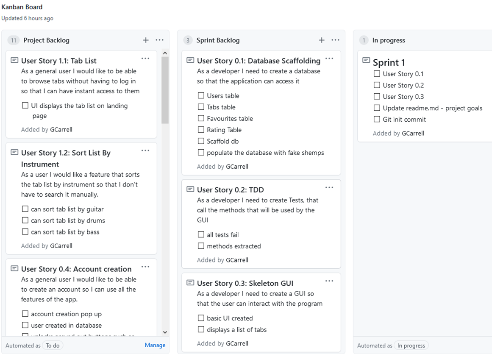
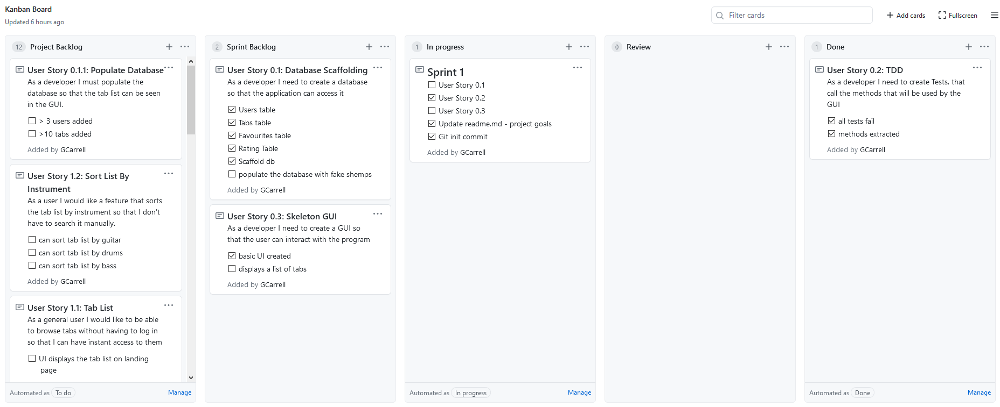

# MusicManager
## Project Overview 
The aim of this project is to create a 3 tier application that will allow the user to easily access and search through music tablature. Users with accounts will be able to upload tabs, rate tabs and add tabs to their favourites.
## Project Goals
The final product will have:
A WPF front end
An SQL database backend with at least two linked tables.
The relationship between the backend object model and database managed by entity framework.
A Business Layer with some logic - not just a simple CRUD application
Unit tests, which exercise the normal functionality, boundary and error conditions.
## Sprint Breakdowns
### Sprint 1
#### Sprint Review
By the end of Sprint one I had aimed to have my database completed and populated with faux data, some nUnit tests created and their methods extracted and a very simplistic GUI. I underestimated the length of time it would take to structure the database so by the end of the sprint I hadn't manage to populate the database, however the database had been created, some CRUD functions had been extracted from the nUnit tests and the GUI would possibly list the tab list if the tab list was populated.
#### Sprint Retrospective
Heading forward, I will base the Sprint backlog on the time I estimate it to take instead of what tasks I want to complete.
#### Goals
- [ ] User Story 0.1
- [x] User Story 0.2
- [ ] User Story 0.3
- [x] Update readme.md - project goals
- [x] Git init commit
#### Sprint Start

##### Sprint End

